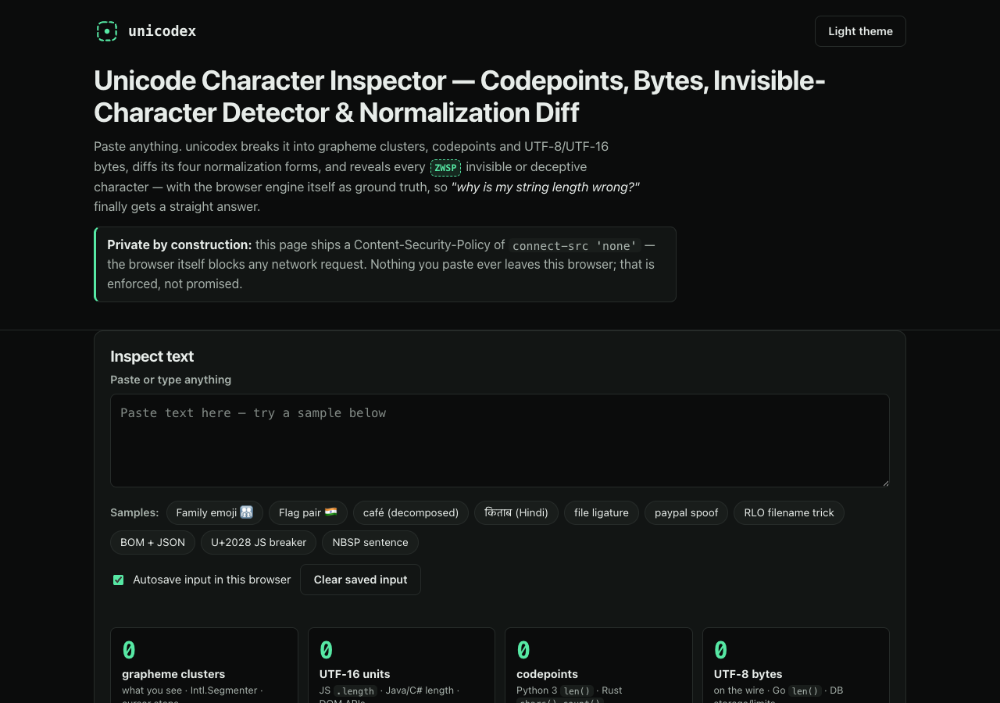

# unicodex

**Unicode character inspector — codepoints, bytes, invisible-character detector & normalization diff.**
Paste anything: unicodex breaks it into grapheme clusters, codepoints and UTF-8/UTF-16 bytes, diffs its
NFC/NFD/NFKC/NFKD forms, and flags the invisible or deceptive characters that break code — with the browser
engine itself (`Intl.Segmenter`, `TextEncoder`, `String.normalize`) as ground truth. 100% client-side,
zero dependencies, works fully offline.



## Why

"Why is my string length wrong?" and "why don't these identical-looking strings match?" are among the most
common — and most maddening — string bugs. The answer is almost always one of four things:

1. **Different counting units.** One family emoji 👨‍👩‍👧‍👦 is 1 visible glyph, 7 codepoints, 11 UTF-16 units
   (JS `.length`) and 25 UTF-8 bytes. Different tools count different things.
2. **Normalization.** A precomposed `é` (NFC) and `e` + combining accent (NFD) render identically and never `===`.
3. **Invisible characters.** Zero-width spaces, BOMs, bidi controls and no-break spaces pasted from docs and chat.
4. **Confusables.** Cyrillic `а` standing in for Latin `a` — a visual match that isn't a real match.

unicodex shows all four side by side, so the mystery dies in seconds instead of an afternoon.

## Features

- **Cluster-by-cluster inspector** — per-grapheme cards (via `Intl.Segmenter`) with codepoints, engine-derived
  class chips (`\p{L}`, `\p{M}`, `\p{Nd}`, `\p{Extended_Pictographic}` …), UTF-8 hex bytes (continuation bytes
  dimmed) and UTF-16 units with surrogate pairs bracketed.
- **Four counts with "who counts what"** — grapheme clusters vs `.length` UTF-16 units vs codepoints vs UTF-8 bytes.
- **Normalization diff** — NFC/NFD/NFKC/NFKD rows via `String.normalize`, changed/unchanged badges, unstable-cluster
  highlighting, copy per form.
- **Flagged-character warnings** — a full-text scan against a hand-verified catalog of 68 risky characters
  (zero-width/format, bidi/Trojan Source, look-alike spaces, line separators, Latin↔Cyrillic/Greek confusables).
  Every entry carries its official Unicode name, a one-line risk, a citation and a verified-on date
  (see [`sources/CITATIONS.md`](./sources/CITATIONS.md)).
- **Compare mode** — raw-equal / NFC-equal / first-divergent-codepoint verdicts for A vs B, plus which flagged
  characters explain a visual match that isn't a real match.
- **Clean copy** — mechanical, idempotent, per-category fixes that state exactly what they replace. The default
  zero-width strip **exempts emoji-sequence ZWJ and inter-letter ZWNJ** (orthographically required in Hindi and
  Persian), with an explicit "strip all, including emoji/Indic joiners" override.
- **Copy-as escapes** — JS `\u{…}`, JSON surrogate pairs, HTML `&#x…;`, Python `\uXXXX`/`\UXXXXXXXX`.
- **Sample gallery** — 10 teaching strings: family emoji, 🇮🇳 flag pair, NFD café, किताब, the fi ligature,
  a Cyrillic "раypal", an RLO Trojan-Source filename, BOM-prefixed JSON, a U+2028 JS-breaker, an NBSP sentence.
- **100% offline** — no accounts, no network, no tracking; optional autosave in localStorage with one-tap clear.

## Quickstart

Just open `index.html` in any modern browser — no build step, no server, no install.

- **Local:** double-click `index.html`, or run any static server in the folder.
- **Hosted:** **[Open unicodex live](https://sreenivas-sadhu-prabhakara.github.io/unicodex/)**

Requires a browser with `Intl.Segmenter` (all evergreen browsers since ~2024).

## Privacy

- A strict Content-Security-Policy sets `connect-src 'none'`: the app **cannot** make any network request even
  if it tried — "pasted text never leaves this browser" is enforced by the browser, not promised by the author.
- No external fonts, scripts, images or analytics. Everything is self-contained.
- Optional autosave keeps your last input in this browser's localStorage only; the toggle and the
  "Clear saved input" button remove it. Clearing site data erases it too.

## The catalog, and how it was verified

The only data file is [`data/flagged.js`](./data/flagged.js): 68 entries (13 zero-width/format, 12 bidi controls,
17 space characters including the ASCII reference row, 2 line/paragraph separators, 24 confusable letters).
Every name was transcribed verbatim from the staged Unicode Character Database file, every confusable mapping
string-matched against the staged UTS #39 `confusablesSummary.txt`, and every bidi control checked against
UAX #9 — all on **2026-07-23**, with the source documents staged in [`sources/`](./sources/) and itemized in
[`sources/CITATIONS.md`](./sources/CITATIONS.md). Everything else the app shows (counts, bytes, clusters,
normalization, class chips) is computed live by the browser engine, never read from data.

Run the self-tests (Node 20+):

```sh
node --test
```

They re-derive every hand-computed fixture (café NFC 4/4/4/5 vs NFD 4/5/5/6, family emoji 1/11/7/25,
किताब → [कि, ता, ब], 😀 → D83D DE00, …), prove the clean-copy joiner exemptions and idempotence, cross-check
byte sums against `TextEncoder` on all gallery samples plus 2 000 seeded random strings, and assert catalog
integrity (unique ids/codepoints, per-class counts 13/12/17/2/24, citation + verified-on on every entry).

## Honest limits

- Cluster counts follow **this browser's** `Intl.Segmenter` and Unicode version; older engines can segment
  Indic conjuncts differently. unicodex reports the host engine's answer and pins only version-stable fixtures.
- **No name database:** arbitrary codepoints show `U+hex` plus engine-derived class chips; official names appear
  only for the 68 flagged catalog entries.
- Confusable flags are a curated ~24-letter subset of UTS #39 — **absence of a warning is not proof a string is
  safe**, and the app never says "safe".
- Rendering varies by device fonts; unicodex inspects what text *is*, not how any device draws it.
- Clean-copy performs only the listed mechanical replacements; it never guesses intent and cannot repair
  encoding damage (mojibake).

## Disclaimer

unicodex is an informational developer tool for inspecting text. It is not a security scanner and never issues a
"safe" verdict; flagged-character coverage is a curated, cited subset of the Unicode data (verified 2026-07-23).
Counts and normalization results come from your browser's engine and may differ across engines and Unicode
versions. This software is provided under the MIT License, "as is", without warranty of any kind; the authors
accept no liability for any loss or damage arising from its use.

## License

[MIT](./LICENSE) © 2026 Sreenivas Sadhu Prabhakara
